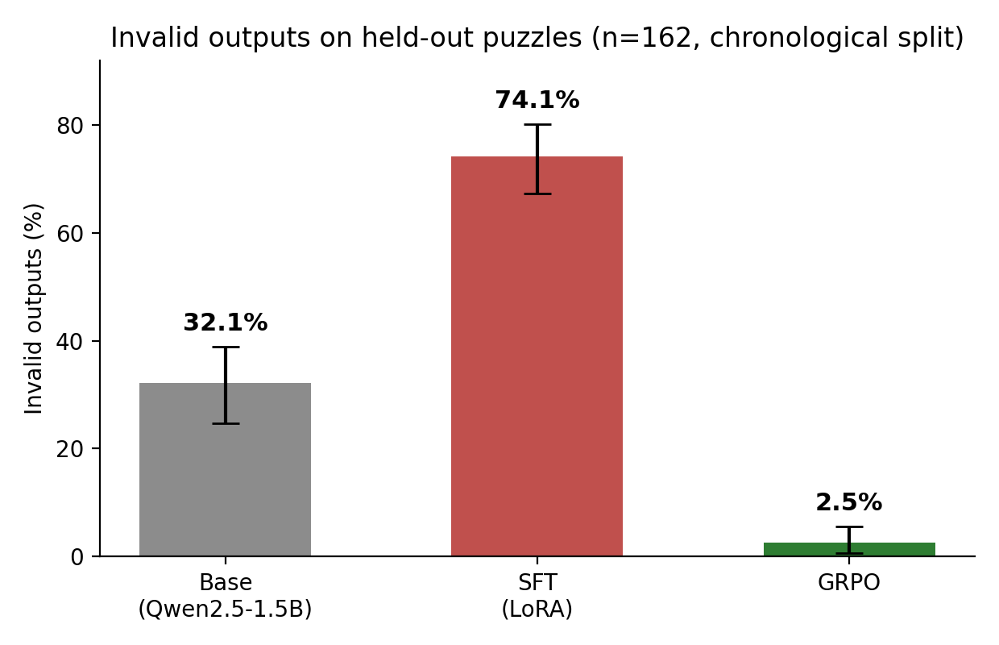

# connections-rl

**GRPO post-training a small open model on NYT Connections, measured with leakage-aware evaluation.**

**Key finding: verifiable-reward RL transfers exactly what the reward can verify.** Invalid outputs fell **74.1% → 2.5%** on held-out puzzles and paired reward gains were significant. Grouping ability did not transfer (0% solve at 1.5B): training reward saturated at its theoretical maximum, policy entropy collapsed to ~0, and the model memorized its 807 training answers. A measured case study in reward over-optimization: bootstrap CIs, McNemar paired tests, and a strictly chronological held-out test set.



**How much of a multi-agent system's gain can a single small open model recover with RL post-training?**

My [ACL 2025 paper](https://aclanthology.org/2025.realm-1.16/) (REALM Workshop; equal-contribution co-author) showed a multi-agent GPT-4o loop solves NYT Connections at 98%, and [gvc-local](https://github.com/jacksonmlukas/gvc-local) pushed an open 8B model to 60% with multi-agent prompting. This repo answers the follow-up: post-train a **1.5–3B open model directly with GRPO** (verifiable-reward RL, DeepSeek-R1 style) and measure it against those baselines with a production-grade evaluation stack.

## Results

Held-out test set: 162 puzzles, strictly *after* every training date (2025-12-15 → 2026-05-29).

| Arm | n | Solve rate (95% CI) | Invalid rate (95% CI) | Mean reward |
| --- | --- | --- | --- | --- |
| gvc-local basic (8B, reference) | 10 | 20.0% [0.0, 50.0] | — | — |
| gvc-local GVC multi-agent (8B, reference) | 10 | 60.0% [30.0, 90.0] | — | — |
| base (Qwen2.5-1.5B) | 162 | 0.0% [0.0, 0.0] | 32.1% [24.7, 38.9] | 0.049 |
| SFT (LoRA) | 162 | 0.0% [0.0, 0.0] | 74.1% [67.3, 80.2] | −0.038 |
| **GRPO** | 162 | 0.0% [0.0, 0.0] | **2.5% [0.6, 5.6]** | **0.113** |

**Headline finding (honest negative result):** at 1.5B, no arm solves any held-out puzzle. GRPO transfers exactly what the verifiable reward can verify. Training reward saturated at the theoretical maximum (1.6: perfect format + all four groups + solve bonus) with policy entropy collapsing to ~0, i.e. the model *memorized* the 807 training answers. On unseen boards the grouping ability doesn't transfer, but the format/board-grounding discipline does: invalid outputs (hallucinated words, malformed answers) drop from 74.1% (SFT) and 32.1% (base) to **2.5%**, and the paired per-puzzle reward gain is significant (+0.152 vs SFT, 95% CI [0.133, 0.169]; +0.064 vs base, [0.046, 0.082]). Full narrative in [`report/`](https://github.com/jacksonmlukas/connections-rl/blob/main/report).

### Scale ablation: Qwen2.5-7B (same data, same reward, same protocol)

| Arm | n | Solve rate | Groups correct (mean) | Invalid rate (95% CI) | Mean reward |
|---|---|---|---|---|---|
| base (Qwen2.5-7B) | 162 | 0.0% | 0.160 | 6.8% [3.1, 11.1] | 0.165 |
| SFT (QLoRA) | 162 | **1.2%** (2/162) | **0.346** | 22.2% [16.0, 28.4] | **0.197** |
| GRPO | 162 | 0.0% | 0.025 | **0.6% [0.0, 1.9]** | 0.125 |

Scale unlocks real competence (base gets 16% of groups; SFT doubles it and produces the first held-out solves), but **GRPO flips from net-positive to net-harmful**: it achieves the best format validity of any arm at any scale (0.6% invalid) while collapsing grouping ability *below the untrained base* — mean reward drops under base. Same memorization mechanism as 1.5B; at 7B there was actual semantic ability to trade away. The cross-scale conclusion: GRPO against this reward optimizes exactly what the reward verifies (structure) at the expense of what it can't (semantics), and whether that trade helps or hurts depends on how much semantic ability the starting policy had.

All arms are evaluated on the same **leakage-aware, date-split held-out test set** with bootstrap CIs, McNemar significance tests between arms, and per-stratum breakdowns. CI re-runs the eval smoke and a release gate (GRPO must not regress vs. SFT beyond the CI) on every push.

## How it works

1. **Data** — reuses gvc-local's tagged puzzle DB (1,078 puzzles, 2023-06 → 2026-05). Splits are strictly chronological: everything trained on predates everything tested on.
2. **Reward** (`connections_rl/reward`) — deterministic and unit-tested: format validity (all 16 board words, 4×4, once each), fully-correct groups / 4, a solve bonus, optional one-away shaping, and a penalty for malformed output.
3. **SFT warm start** (`make train-sft`) — rank-16 LoRA on the train split.
4. **GRPO** (`make train-grpo`) — K completions per puzzle, group-relative advantage, KL penalty to the SFT reference. Runs on a free Colab T4 (`notebooks/colab_grpo.ipynb`); scales to Kaggle 2×T4 via accelerate/FSDP (`notebooks/kaggle_2xt4_fsdp.ipynb`, `configs/accelerate/fsdp_2xt4.yaml`).
5. **Eval** (`make eval`) — stratified sampling, bootstrap CIs, paired significance tests, reliability/ECE utilities; results committed under `results/`.
6. **Serving** (`make serve`) — FastAPI over vLLM with `/solve`, `/compare` (base vs. GRPO on the same board), `/health`, `/metrics`. `docker compose up` runs the full stack.

## Quickstart

```
git clone https://github.com/jacksonmlukas/connections-rl && cd connections-rl
make setup                 # pip install -e ".[dev]"
export CONNECTIONS_PUZZLES=path/to/gvc-local/data/puzzles/tagged_connections.json
make data                  # leakage-aware splits + SFT chat data
make test lint             # unit tests + ruff + mypy
make eval-smoke            # end-to-end harness check, no GPU needed
```

Training (GPU): open `notebooks/colab_grpo.ipynb` on Colab, or:

```
pip install -e ".[train]"
make train-sft && make train-grpo
```

Serving:

```
docker compose up          # vLLM + API
curl -X POST localhost:8080/compare -H 'content-type: application/json' \
  -d '{"words": ["HAIL","RAIN","SLEET","SNOW","BUCKS","HEAT","JAZZ","NETS","OPTION","RETURN","SHIFT","TAB","KAYAK","LEVEL","MOM","RACECAR"]}'
```

## Repo map

```
configs/        model / train / eval / accelerate configs
src/connections_rl/
  data/         puzzle loading, date splits, chat formatting
  reward/       verifiable reward (the RL core)
  train/        sft.py (LoRA), grpo.py (TRL GRPOTrainer)
  eval/         harness, bootstrap/McNemar/ECE stats, release gate
  serve/        FastAPI + vLLM serving, request monitoring
  report/       results table + plots
notebooks/      Colab T4 (GRPO) and Kaggle 2×T4 (FSDP) runbooks
results/        committed metrics (the evidence)
report/         technical writeup
```

## Related

- [gvc-local](https://github.com/jacksonmlukas/gvc-local) — multi-agent prompting predecessor; source of the puzzle DB and the 60% baseline.
- [Snap Out of It (ACL 2025, REALM Workshop)](https://aclanthology.org/2025.realm-1.16/) — multi-agent GPT-4o loop at 98%; equal-contribution co-author.

MIT license.
