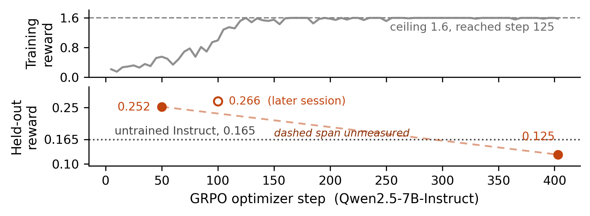

# connections-rl

**Artifact record for *Reliable and Invalid: Anatomy of a Gamed Training Task*** — a
GRPO run on NYT Connections whose every in-sample signal read as mastery, and
which a one-line data-loader bug had made trivially gameable.

📄 **Paper:** [`tex/tae_submission.pdf`](tex/tae_submission.pdf) (NeurIPS 2026,
Foundations of LLM Post-Training workshop). Every table in it traces to a file in
this repo; the map is [below](#artifact-map).

MIT license covers **this repository's code only** — not the puzzle content. See
[Data provenance](#data-provenance-and-license).



## The finding

A one-line bug in the GRPO data loader presented each board's sixteen words in
answer-key order — positions 1–4 were group 1, 5–8 group 2, and so on. The
training task became solvable by copying words four at a time, and the policy
learned exactly that. Every in-sample signal read the gaming as mastery: training
reward saturated at its theoretical ceiling of 1.6 (0.1 format + 1.0 grouping +
0.5 solve bonus, per [`configs/train/grpo-7b.yaml`](configs/train/grpo-7b.yaml)),
across-rollout variance went to zero, and policy entropy collapsed. Held-out
evaluation reversed the verdict: the endpoint scores **4 of 648 group slots**
against the untrained model's **26** ([`results-analysis/aug27/memC-session-test/`](results-analysis/aug27/memC-session-test/),
paper Table 2).

**This is not memorization.** A memorizing policy would score well on the boards
it trained on; scored on those same 807 training boards with shuffled prompts,
the endpoint gets **21 of 3,228 slots**
([`results-analysis/aug27/memC-session-train/grpo-final/metrics.json`](results-analysis/aug27/memC-session-train/grpo-final/metrics.json)).
What it learned is a *positional copy rule*: on answer-ordered training prompts
it emits consecutive quadruples at a **91.4% group-level rate** (2,946 of 3,224
groups, [`results-analysis/aug27/copy_rule_results.json`](results-analysis/aug27/copy_rule_results.json),
paper §7 and Table 7). The rule is worth full reward on leaked prompts and worth
almost nothing on shuffled ones.

The gameable object was the **task**, not the algorithm. Supervised fine-tuning on
the leaked prompts alone — no RL at all — converges to a perfect copier: **1 of
648 slots at a copy rate of 1.000**
([`results-analysis/sep05/finals_summary.json`](results-analysis/sep05/finals_summary.json),
arm `sft-leaked`).

## The repaired recipe

One line fixes it: seed the board shuffle from the puzzle id, so GRPO prompts
match what SFT and every eval already used
([`src/connections_rl/train/grpo.py`](src/connections_rl/train/grpo.py),
regression-locked by [`tests/test_grpo_prompts.py`](tests/test_grpo_prompts.py)).

With that single change and **the same reward, trainer, and hyperparameters**,
the run produces the best policies in the study — no collapse:

| Seed | Held-out group slots (of 648) | Source |
|---|---|---|
| 0 | **148** | [`results-analysis/aug29/leakfree_summary.json`](results-analysis/aug29/leakfree_summary.json) (`shuffled-final`) |
| 1 | **135** | [`results-analysis/sep05/finals_summary.json`](results-analysis/sep05/finals_summary.json) (`s1-final`) |
| 2 | **129** | [`results-analysis/sep05/finals_summary.json`](results-analysis/sep05/finals_summary.json) (`s2-final`) |
| — untrained reference | 26 | same sessions, arm `base` |

That is roughly **5× the untrained model** on the same held-out split, from the
recipe that looked like a failure until the loader was fixed.

## Artifact map

Every path below exists in this repo. Paper table and figure numbers are as
rendered in [`tex/tae_submission.pdf`](tex/tae_submission.pdf).

| Paper element | Artifact |
|---|---|
| Table 2 (7B test split) and Table 3 (control session) | [`results-analysis/aug27/memC-session-test/`](results-analysis/aug27/memC-session-test/), [`memC-session-train/`](results-analysis/aug27/memC-session-train/) |
| Table 4 (leak-free session) | [`results-analysis/aug29/leakfree-session-test/`](results-analysis/aug29/leakfree-session-test/) |
| Figure 1 + Table 5 (entropy/KL sweep, Appendix B) | [`results-analysis/entropy-kl-7b.json`](results-analysis/entropy-kl-7b.json) |
| Figure 2 (reward in sample vs held out) | [`data/wandb_train_reward.csv`](data/wandb_train_reward.csv) → [`figs/make_fig3_reward_curves.py`](figs/make_fig3_reward_curves.py) |
| Table 6 (7B endpoints, three seeds) | [`results-seeds-7b/`](results-seeds-7b/) |
| Table 7 (copy-rule rates) | [`results-analysis/aug27/copy_rule_results.json`](results-analysis/aug27/copy_rule_results.json) |
| Table 8 (1.5B test split) | [`results/`](results/) |
| Appendix E (full training log) | [`results-analysis/aug29/leakfree-kaggle-run.log`](results-analysis/aug29/leakfree-kaggle-run.log) |
| Leaked run's validation grid | [`results-analysis/ckpt-curve-7b.json`](results-analysis/ckpt-curve-7b.json) |
| Seeds 1–2 + leaked-SFT session | [`results-analysis/sep05/`](results-analysis/sep05/) |
| Empirical copier ceiling | [`results-analysis/sep06/empirical_floor.json`](results-analysis/sep06/empirical_floor.json), regenerate with [`scripts/empirical_copy_floor.py`](scripts/empirical_copy_floor.py) |
| Step-50 replication session | [`results-analysis/sep07/`](results-analysis/sep07/) |
| 1.5B scale contrast | [`results-seeds-1.5b/`](results-seeds-1.5b/), [`results-analysis/passk-1.5b.json`](results-analysis/passk-1.5b.json) |

How often would a copy rule win *by chance* on properly shuffled boards? Realized
aligned quadruples: **3 of 807** training boards and **1 of 162** test boards,
against uniform expectations of 7.10 and 1.42 (Poisson tail p = 0.077 and 0.58) —
[`results-analysis/sep06/empirical_floor.json`](results-analysis/sep06/empirical_floor.json).

Each results directory carries its own README describing its session and which
table cites it. Those files are an immutable record: regenerate elsewhere, never
edit in place.

## Historical results (pre-diagnosis notes: superseded by the paper)

The tables below were written before the leak was found. **The numbers stand —
they are the leaked run, measured correctly — but the original framing did not.**
The GRPO arms here are gamed-task artifacts, not evidence about GRPO or about
reward over-optimization at these scales. Where this section and the paper
disagree, the paper wins. The same applies to the lab notes in
[`report/`](report/), which are kept verbatim and carry a banner to that effect.

Held-out test set: 162 puzzles, strictly *after* every training date
(2025-12-15 → 2026-05-29).

**1.5B** — source [`results/{base,sft,grpo}/metrics.json`](results/):

| Arm | n | Solve rate (95% CI) | Invalid rate (95% CI) | Mean reward |
| --- | --- | --- | --- | --- |
| base (Qwen2.5-1.5B) | 162 | 0.0% [0.0, 0.0] | 32.1% [24.7, 38.9] | 0.049 |
| SFT (LoRA) | 162 | 0.0% [0.0, 0.0] | 74.1% [67.3, 80.2] | −0.038 |
| GRPO (seed 0, leaked) | 162 | 0.0% [0.0, 0.0] | 2.5% [0.6, 5.6] | 0.113 |

**7B** — source [`results-7b/{base,sft,grpo}/metrics.json`](results-7b/).
`Groups correct` is a mean count on a 0–4 scale; divide by 4 for percent.

| Arm | n | Solve rate | Groups correct (0–4) | Invalid rate (95% CI) | Mean reward |
|---|---|---|---|---|---|
| base (Qwen2.5-7B) | 162 | 0.0% | 0.160 | 6.8% [3.1, 11.1] | 0.165 |
| SFT (QLoRA) | 162 | 1.2% (2/162) | 0.346 | 22.2% [16.0, 28.4] | 0.197 |
| GRPO (seed 0, leaked) | 162 | 0.0% | 0.025 | 0.6% [0.0, 1.9] | 0.125 |

Note this 7B table is a *different serving session* from the paper's Table 2: the
SFT row reads 0.346 (56/648) here and 0.321 (52/648) there. Base and GRPO agree
exactly. Across the four observed sessions the SFT arm decodes 52–56 slots; see
[`results-7b/README.md`](results-7b/README.md).

**Sampling budget (pass@16, 7B).** Wider search does not rescue the leaked arm:
base 4.0% → 11.4% of groups, SFT 8.6% → 25.2%, GRPO 0.6% → 2.2%. Sources:
pass@1 = `groups_correct` ÷ 4 from [`results-7b/`](results-7b/); best-of-16 =
`best_of_k_groups_correct` × 100 from
[`results-analysis/passk-7b.json`](results-analysis/passk-7b.json).

**Seed replication and weight-space convergence.** Three GRPO seeds per scale,
each re-run from the same SFT warm start
([`results-seeds-7b/`](results-seeds-7b/), [`results-seeds-1.5b/`](results-seeds-1.5b/)).
Cosine similarity between seeds' RL-induced LoRA updates is +0.67 to +0.69 at 7B
and +0.78 to +0.80 at 1.5B, against a random-direction expectation of ~1e−5
([`results-seeds/weight_space_7b.txt`](results-seeds/weight_space_7b.txt),
[`weight_space_1.5b.txt`](results-seeds/weight_space_1.5b.txt)). Read now, this
says the seeds all found the same copy rule — a property of the gamed task, not
an attractor of the optimizer.

## Data provenance and license

The puzzle data originates from the [gvc-local](https://github.com/jacksonmlukas/gvc-local)
pipeline (`data/puzzles/tagged_connections.json`), whose records come from the
public community archive
[Eyefyre/NYT-Connections-Answers](https://github.com/Eyefyre/NYT-Connections-Answers),
augmented there with heuristic stratum tags and stable ids.

**The New York Times retains all rights in the Connections puzzles themselves.**
This work exists to support non-commercial research reproducibility. It is not an
authorized republication, and **nothing in this repository's MIT license applies
to the puzzle content** — the MIT grant covers this repository's code only. If
you are the rights holder and would like this data removed, open an issue and it
will be taken down.

Downstream users: credit NYT Connections as the source of the puzzles, do not
redistribute the puzzle data under a permissive license, and do not use it
commercially.

## Reproduction

```
git clone https://github.com/jacksonmlukas/connections-rl && cd connections-rl
make setup                 # pip install -e ".[dev]"
export CONNECTIONS_PUZZLES=path/to/gvc-local/data/puzzles/tagged_connections.json
make data                  # leakage-aware splits + SFT chat data
make test lint             # unit tests + ruff + mypy
make eval-smoke            # end-to-end harness check, no GPU (rewrites results/smoke/)
```

`make data` needs `CONNECTIONS_PUZZLES` pointing at gvc-local's puzzle DB and
network access; the test suite runs offline on bundled fixtures without it.

Training (GPU): open [`notebooks/colab_grpo.ipynb`](notebooks/colab_grpo.ipynb),
or `pip install -e ".[train]"` then `make train-sft && make train-grpo`.
Serving: `docker compose up` brings up vLLM + the FastAPI app (`make serve`).

**Published adapters.** Eight LoRA/QLoRA adapters plus the raw-results dataset are
on the Hub under `jacksonlukas/`; the cards committed here are the source of
truth for what each one is: [`hub_cards/`](hub_cards/).

### Notebook era map

Notebooks were written across four eras; they are not interchangeable.

- [`notebooks/`](notebooks/) — original 1.5B/7B era (training, eval, seed runs, analysis).
- [`results-analysis/aug29/leakfree_kaggle.ipynb`](results-analysis/aug29/leakfree_kaggle.ipynb) — leak-free rerun, seed 0.
- [`results-analysis/sep05/seeds_leakedsft_kaggle.ipynb`](results-analysis/sep05/seeds_leakedsft_kaggle.ipynb) — leak-free seeds 1–2 plus the leaked-SFT arm.
- [`results-analysis/sep07/step50_seeds_kaggle.ipynb`](results-analysis/sep07/step50_seeds_kaggle.ipynb) — step-50 replication on the leaked seeds.
- [`results-analysis/sep04/answer_ordered_kaggle.ipynb`](results-analysis/sep04/answer_ordered_kaggle.ipynb) — answer-ordered eval: **queued, not yet run**, no outputs committed.

## How it works

1. **Data** — reuses gvc-local's tagged puzzle DB (1,078 puzzles, 2023-06 → 2026-05). Splits are strictly chronological: everything trained on predates everything tested on.
2. **Reward** ([`src/connections_rl/reward/`](src/connections_rl/reward/)) — deterministic and unit-tested: format validity (all 16 board words, 4×4, once each), fully-correct groups / 4, a solve bonus, optional one-away shaping, and a penalty for malformed output.
3. **SFT warm start** (`make train-sft`) — rank-16 LoRA on the train split.
4. **GRPO** (`make train-grpo`) — K=8 completions per puzzle, group-relative advantage, KL penalty to the SFT reference. Single-GPU on a free Colab/Kaggle T4; QLoRA for 7B. Normalization settings are recorded in [`report/implementation_notes.md`](report/implementation_notes.md).
5. **Eval** (`make eval`) — stratified sampling, bootstrap CIs, paired significance tests, plus `eval/passk.py`, `eval/checkpoint_curve.py`, `eval/entropy_kl.py`.
6. **Serving** (`make serve`) — FastAPI over vLLM with `/solve`, `/compare`, `/health`, `/metrics`.

## Related

- [gvc-local](https://github.com/jacksonmlukas/gvc-local) — multi-agent prompting predecessor; source of the puzzle DB.
- [Snap Out of It (ACL 2025, REALM Workshop)](https://aclanthology.org/2025.realm-1.16/) — multi-agent GPT-4o loop at 98%; equal-contribution co-author.

MIT license (code only — see [Data provenance](#data-provenance-and-license)).
